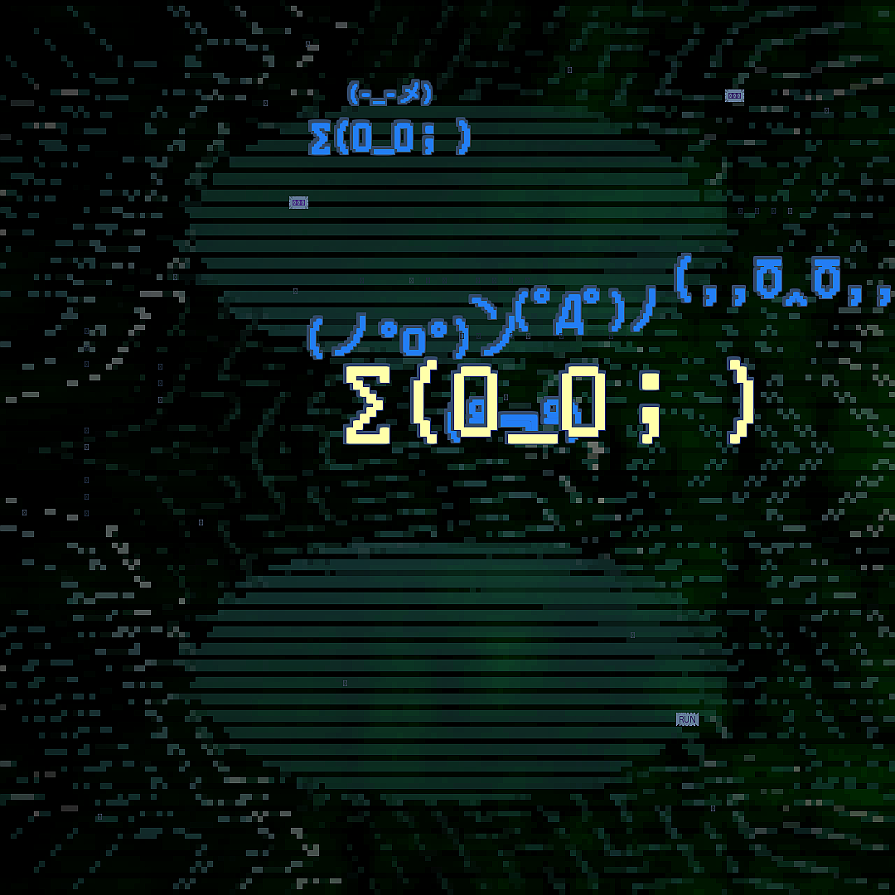
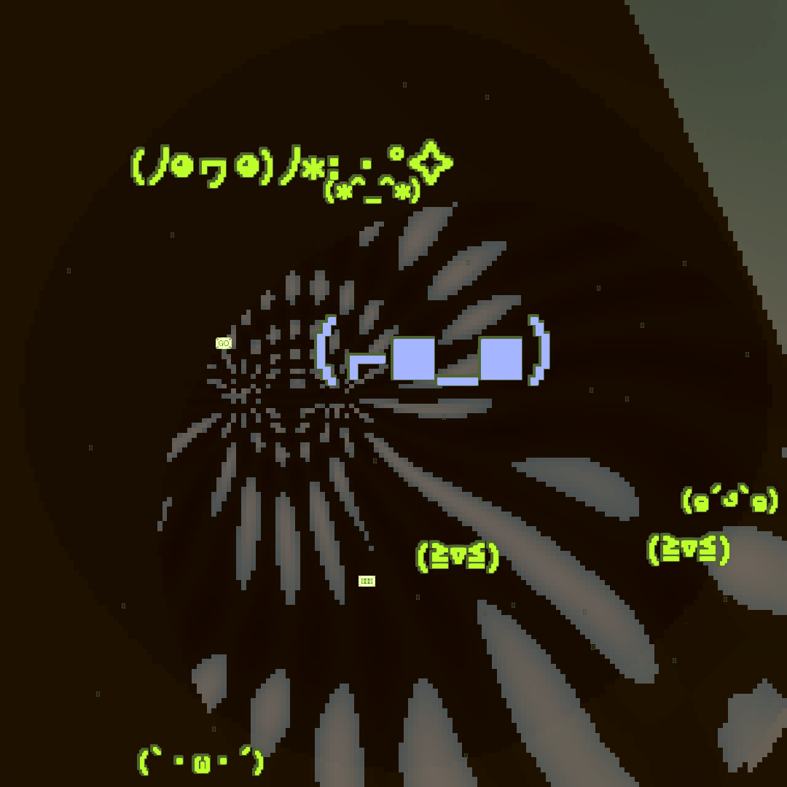

# viz - ASCII Art Visualization Toolkit

[](https://github.com/aaajiao/VIZ/actions/workflows/test.yml)

PNG/GIF/MP4 ASCII art. Variable resolution (default 1080x1080, up to 3840px), custom palettes, kaomoji, procedural effects, emotion-driven styles. Pure Python 3 + Pillow.

<p align="center">
  
  
</p>

## Quick Start

```bash
pip install Pillow

# Generate from emotion
python3 viz.py generate --emotion euphoria --seed 42

# AI integration via stdin JSON
echo '{"headline":"BTC $95K","emotion":"euphoria","metrics":["ETH: $4.2k"]}' | python3 viz.py generate

# Animated GIF
echo '{"emotion":"panic","video":true}' | python3 viz.py generate

# Discover all options
python3 viz.py capabilities --format json
```

## How It Works

`viz.py` is the single CLI entry — a rendering backend for AI. AI decides *what* to express; VIZ decides *how* it looks.

```
emotion/text  -->  VAD vector  -->  grammar  -->  SceneSpec  -->  Engine  -->  output
                   (continuous)     (stochastic)   (full spec)    (auto-      (PNG/GIF/MP4,
                                                                  scaled)     variable res)
```

Everything is driven by the **VAD emotion model** (Valence-Arousal-Dominance). 26 named emotions map to points in continuous 3D space. The grammar system samples visual choices weighted by emotion — same emotion + different seed = different output.

Combinatorial space: 17 effects x 86 variants x 9 transforms x 7 postfx x 6 masks x 73 gradients x 8 decorations x bg_fill combos x continuous params = effectively infinite.

## Commands

| Command | Purpose |
|---------|---------|
| `generate` | Render visualization (variable resolution, PNG/GIF/MP4) |
| `convert` | Convert image to ASCII art |
| `capabilities` | Output full inventory as JSON for AI discovery |

## Input (stdin JSON, all fields optional)

```json
{
  "emotion": "euphoria",
  "headline": "BTC $95K",
  "metrics": ["ETH: $4.2k", "SOL: $300"],
  "vocabulary": {"particles": "$€¥₿↑↓", "kaomoji_moods": ["euphoria", "excitement"]}
}
```

Emotion drives all visual choices. `vocabulary` overrides specific visual assets (particles, kaomoji moods, decoration chars). Full field reference in [docs/ai-integration.md](docs/ai-integration.md).

## Output

```json
{"status": "ok", "results": [{"path": "media/viz_20260203_120000_s42.png", "seed": 42, "format": "png"}], "emotion": "euphoria", "resolution": [1080, 1080]}
```

## Director Mode

Grammar auto-selects everything from emotion. Override any dimension for precise control:

```bash
python3 viz.py generate --emotion euphoria --seed 100 \
  --effect plasma --variant warped \
  --transforms kaleidoscope:segments=6 \
  --postfx vignette:strength=0.5 scanlines:spacing=4 \
  --composition radial_masked
```

Details in [docs/composition.md](docs/composition.md).

## Project Structure

```
viz.py                          # Single CLI entry
lib/                            # Shared: kaomoji, content, box-drawing chars, vocabulary
procedural/
  engine.py                     # Render orchestrator (auto-scaled buffer -> output)
  effects/                      # 17 pluggable effects + 86 structural variants
  transforms.py                 # 9 domain transforms (mirror, kaleidoscope, tile, ...)
  postfx.py                     # 7 buffer-level post-FX (vignette, scanlines, ...)
  masks.py                      # 6 spatial masks (radial, noise, sdf, ...)
  flexible/
    emotion.py                  # VAD continuous emotion space (26 anchors)
    grammar.py                  # Stochastic visual grammar
    pipeline.py                 # Main pipeline orchestrator
docs/                           # Detailed documentation
skills/viz-ascii-art/           # AgentSkills integration
```

## Documentation

| Doc | Content |
|-----|---------|
| [ai-integration.md](docs/ai-integration.md) | **Start here.** JSON protocol, capabilities, examples |
| [usage.md](docs/usage.md) | CLI args, all commands |
| [flexible.md](docs/flexible.md) | VAD model, grammar, SceneSpec |
| [composition.md](docs/composition.md) | Transforms, masks, PostFX, variants |
| [effects.md](docs/effects.md) | 17 effects with params |
| [kaomoji.md](docs/kaomoji.md) | 22 moods, 336 faces |
| [box_chars.md](docs/box_chars.md) | 73 gradients, 37 charsets |
| [rendering.md](docs/rendering.md) | Engine internals |

## Development

```bash
pytest tests/ -v          # 545+ tests
```

Only dependency: `Pillow>=9.0.0`. All math is pure Python stdlib (no NumPy). MP4 output requires system FFmpeg.

## License

MIT - see [LICENSE](LICENSE)

## Reference

- [play.ertdfgcvb.xyz](https://play.ertdfgcvb.xyz) - Inspiration
- [play.core](https://github.com/ertdfgcvb/play.core) - Core reference
